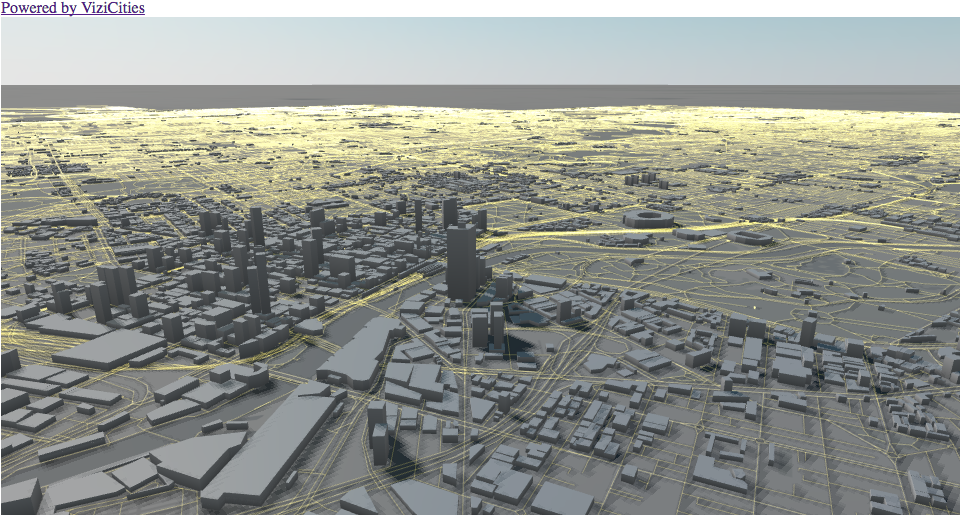

# vizicitiesway
R implementation of vizicities https://github.com/UDST/vizicities

## Base map

```
devtools::install_github("SymbolixAU/vizicitiesway")
library(vizicitiesway)
vizicitiesway()
```

## sunlight over Melbourne

```
vizicitiesway(location = c(-37.9, 145), mapControls = TRUE, buildings = TRUE, sun = TRUE)
```




